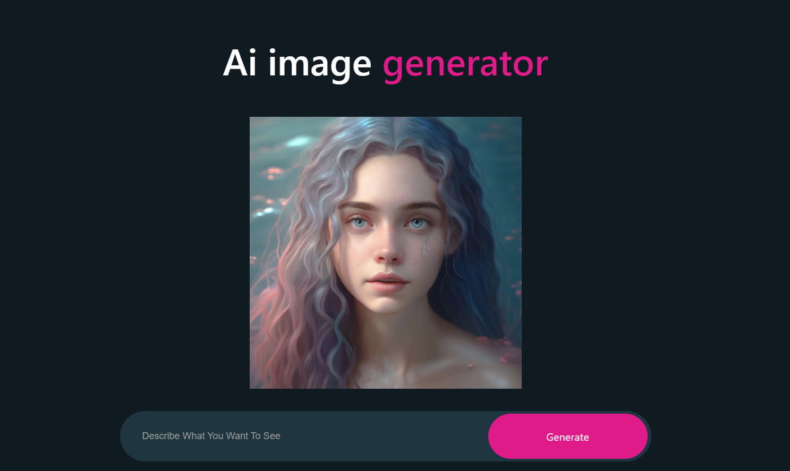

# AI Image Generator 🖼️

This project allows users to obtain images generated by artificial intelligence using a text input. It works using OpenAI's API.

## Live Demo 🚀

Check out the live demo [here](https://ai-image-generator-private.vercel.app).



## Installation 🛠️

1. Clone the repository:

    ```bash
    git clone https://github.com/username/ai-image-generator.git
    ```

2. Navigate to the project directory:

    ```bash
    cd ai-image-generator
    ```

3. Install the necessary dependencies:

    ```bash
    npm install
    ```

4. Add your API key to the `.env` file:

    ```
    API_KEY=YOUR_OPENAI_API_KEY
    ```

5. Start the application:

    ```bash
    npm start
    ```

## Usage 🚀

1. Open [http://localhost:3000](http://localhost:3000) in your browser.
2. Write a description in the "Describe What You Want To See" field.
3. Click on the "Generate" button.
4. The artificial intelligence will generate an image based on the text you entered. The generated image will be displayed at the top of the page.

## Features ✨

- User-friendly interface.
- High-quality images generated by artificial intelligence.
- Advanced loading status indicator.

## Contributing 🤝

1. Fork this repository.
2. Create a new branch: `git checkout -b new-feature`
3. Commit your changes: `git commit -am 'Added a new feature'`
4. Push to the branch: `git push origin new-feature`
5. Submit a pull request.

## License 📝

This project is licensed under the MIT License. See the `LICENSE` file for more information.
